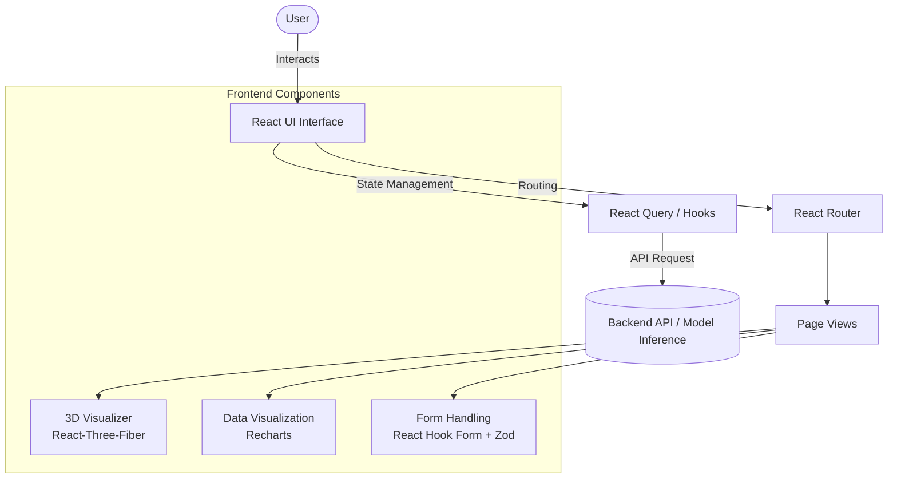

# AgriVision AI

Welcome to **AgriVision AI**, built for the AMD Hackathon. This project is a modern web application leveraging Vite, React, TypeScript, and interactive 3D elements powered by Three.js/React-Three-Fiber, along with beautifully styled components via Shadcn UI and Tailwind CSS.

## 🌟 Features
- **Modern Tech Stack**: Scaffolded with Vite for lightning-fast builds and HMR.
- **Robust UI/UX**: Built with Radix UI, Framer Motion for animations, and Shadcn components.
- **Interactive 3D Visuals**: Incorporates `@react-three/fiber` and `@react-three/drei` for immersive experiences.
- **Data Visualization**: Recharts for metrics and analytics display.
- **Type-Safe**: 100% written in TypeScript.

## 🏗️ Architecture & Flow

Here is a high-level representation of the application's flow and architecture:



## 🛠️ Development Setup

To get started locally:

1. Clone the repository
   ```bash
   git clone https://github.com/ansar-lab/amd-hackathon.git
   cd amd-hackathon
   ```
2. Install dependencies
   ```bash
   npm install
   ```
3. Run the development server
   ```bash
   npm run dev
   ```

## 📜 License
This project is part of the AMD Hackathon. All rights reserved by Ansar-Lab.
